# Forensische Praxis

Unsere Website ist eine forensische Praxis. Diese Praxis besteht aus einer Rechtsmedizinerin, einer Juristin und einem MPA/ Anwaltsgehilfen. Die Idee hinter der Praxis ist, dass man bei einem Unfall oder häuslicher Gewallt unsere Praxis aufsuchen kann, bei der eine medizinische Versorgung und Dokumentation sowie die rechtliche Stütze vorhanden ist.
Diese Praxisidee kam zustande da wir so unsere individuellen beruflichen Ziele vereibaren können und uns während dieses Arbeitsauftrages näher mit den von uns verfolgten Berufszielen auseinandersetzen können. Als uns diese Idee kam war es auch schnell kar wie wir die Website strukturieren wollen und welche einzelnen Seiten wir passend finden. 

## Projektplan

Auf jeder Unterseite unserer Website befindet sich ein header mit unserem Logo und ein footer mit den wichtigsten Daten zu unserer Praxis. Ausserdem hat man mithilfe des Menus immer zugang zu jeder Unterseite. Beim Menu wollten wir hover-Effekt einbauen. 
Allgemein war es uns wichtig einheitliche Schriftarten und Schriftgrössen zu verwenden. Dies konnten wir mithilfe des css programmieren.
 Auf der ganzen Website werden auch nur zwei Titel verwendet. Dies dient zur einheitlichen Gestalltung.  

### Hauptseite - home
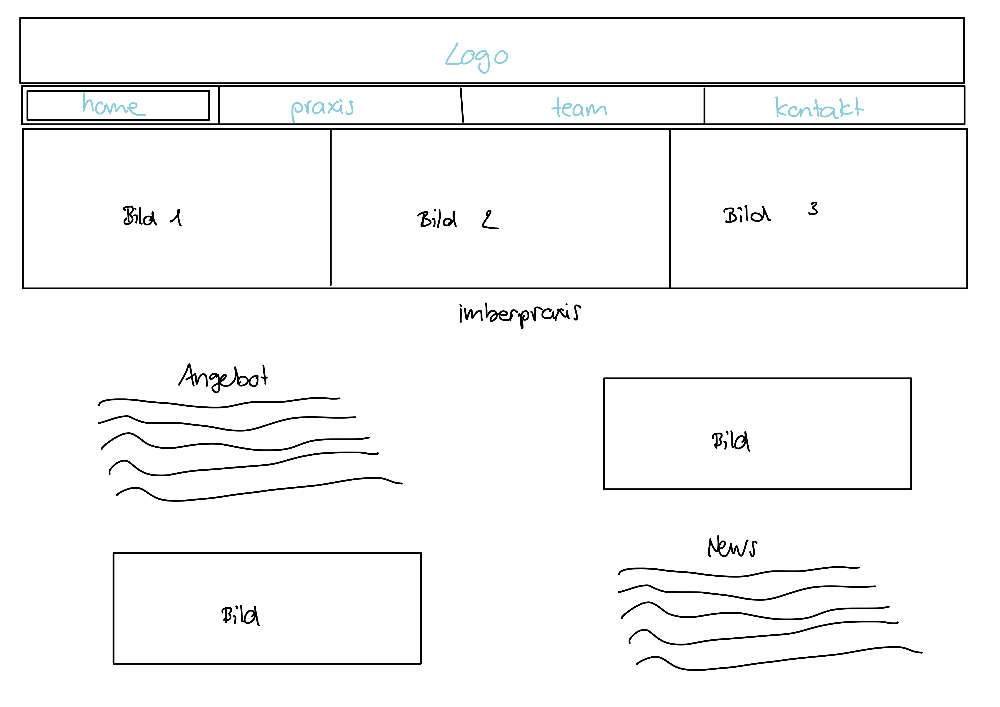


### Unterseite - praxis
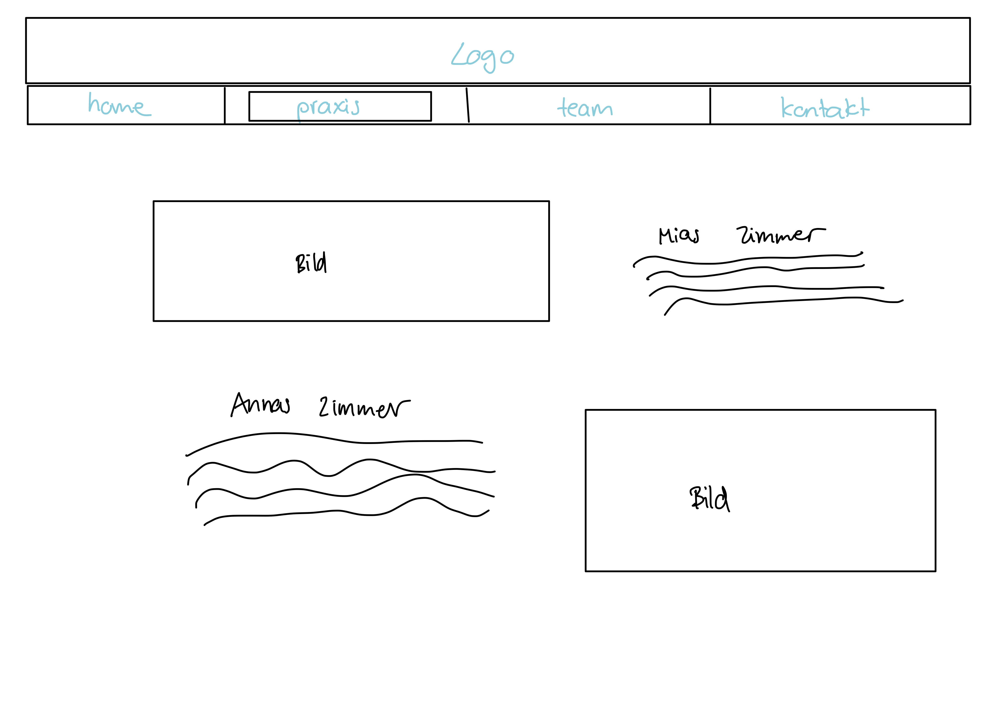


### Unterseite - team
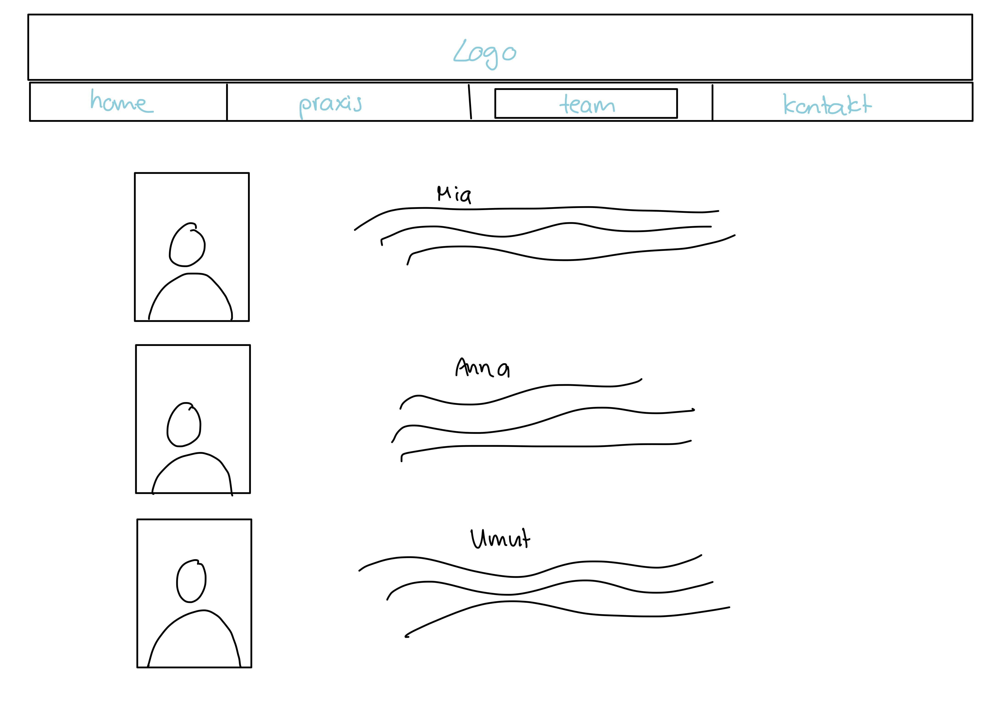


### Unterseite - kontakt 
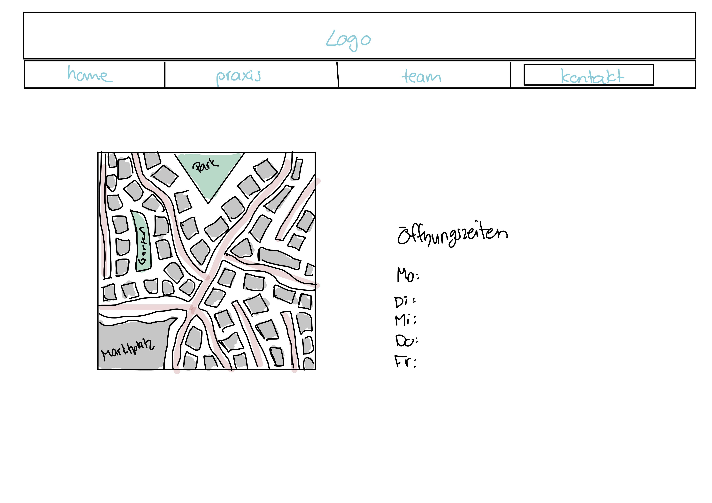


## Zeitplan

Zeitplan mit mindestens wöchentlichen Meilensteinen. Wann setzt wer etwas um?

| Deadline | Name | Beschreibung |
| --- | --- | --- |
| 03.05.2021 | Anna Bühler und Mia Hollenstein | Thema der Website ausgesucht |
| 09.05.2021 | Anna Bühler und Mia Hollenstein| Zeitplan geschrieben|
| 10.05.2021 | Anna Bühler und Mia Hollenstein | Planung des Aufbaus der Website |
| 10.05.2021 |  Anna Bühler und Mia Hollenstein| haeder und footer gemacht, Logo gestalltet , Öffnungszeiten hinzugefügt|
| 17.05.2021 | Anna Bühler |Menue mit hover- Effekt, Anwendung flex-Box, Formatierung |
| 17.05.2021 | Mia Hollenstein | Text für home Seite geschrieben, begonnen mit der Bilderwahl, Kurzbeschreibung der Website im readme geschrieben |
| 21.05.2021 | Anna Bühler und Mia Hollenstein | home- und kontaktseite formatiert |
| 23.05.2021 | Anna Bühler | praxis- und teamseite formatiert, css strukturiert und kommentiert || 04.01.2021 | Vorname Name | Das wird gemacht |
| 23.05.2021 | Mia Hollenstein | readme weitergeschrieben |
| 24.05.2021 | Anna Bühler und Mia Hollenstein | Bilder eingefügt, Text fertig geschrieben und eingefügt auf allen Seiten, readme fertiggestellt  |


## Umsetzung

Detaillierte Beschreibung der umgesetzten Webseite.

### Hauptseite
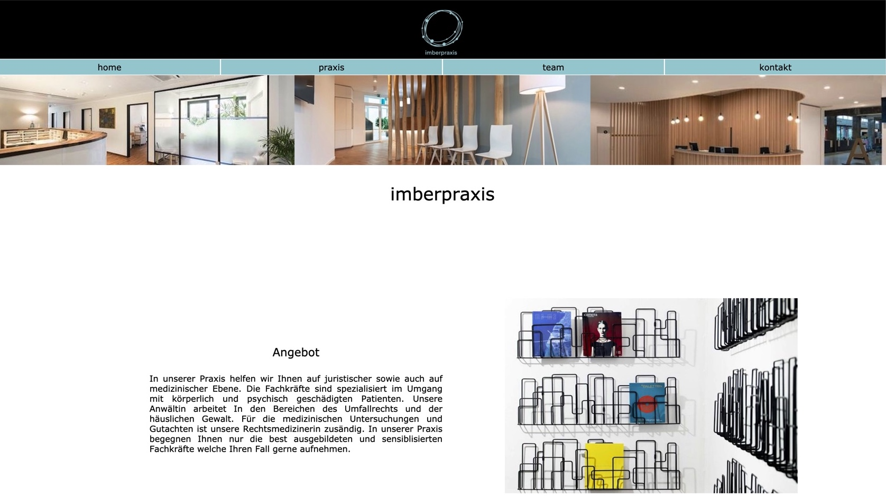
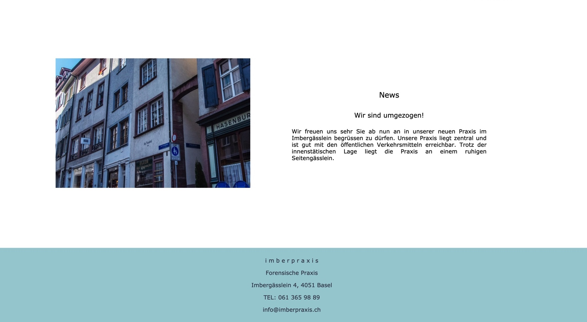


### Unterseite 1
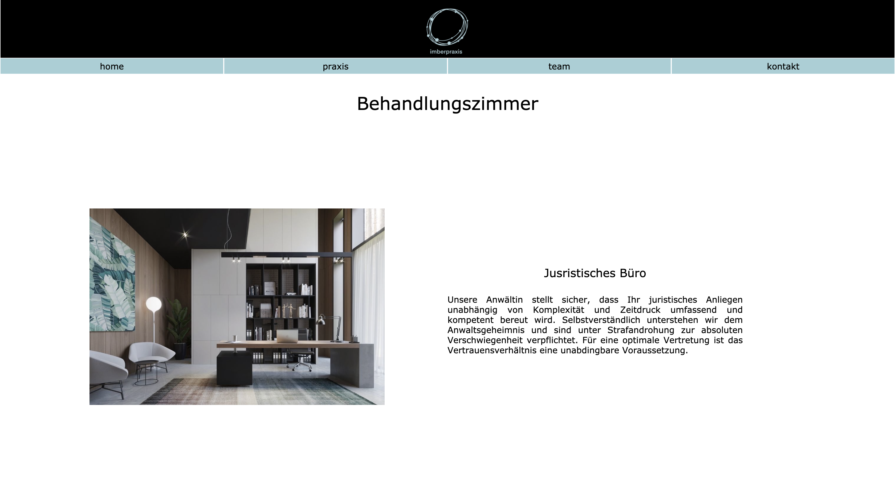
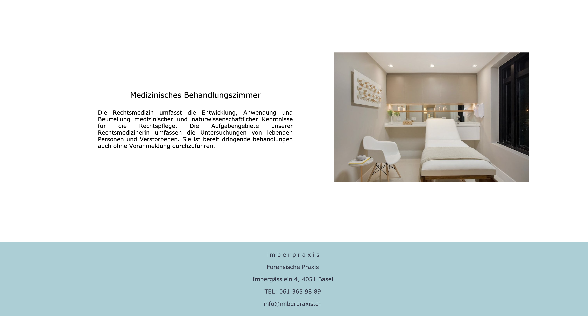

### Unterseite 2
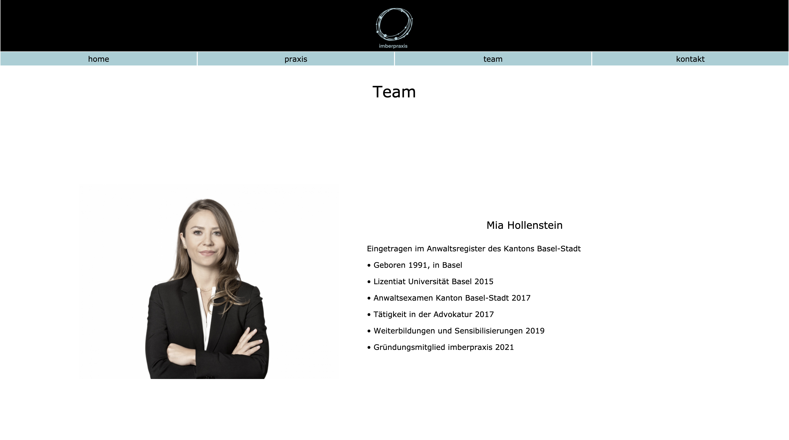
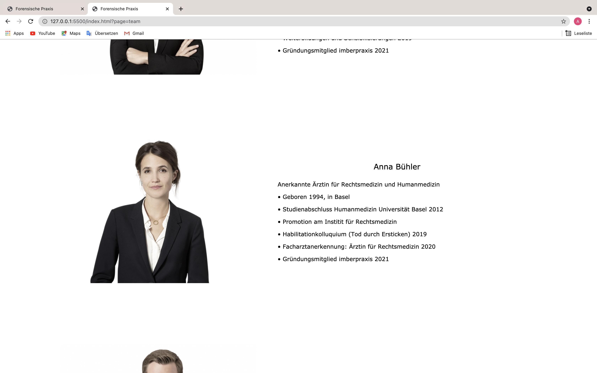
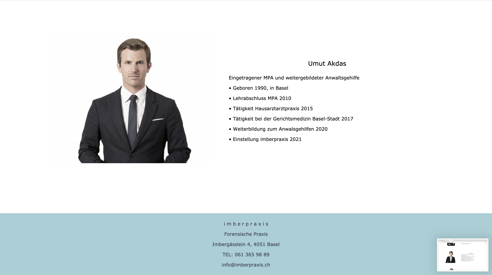


### Unterseite 3
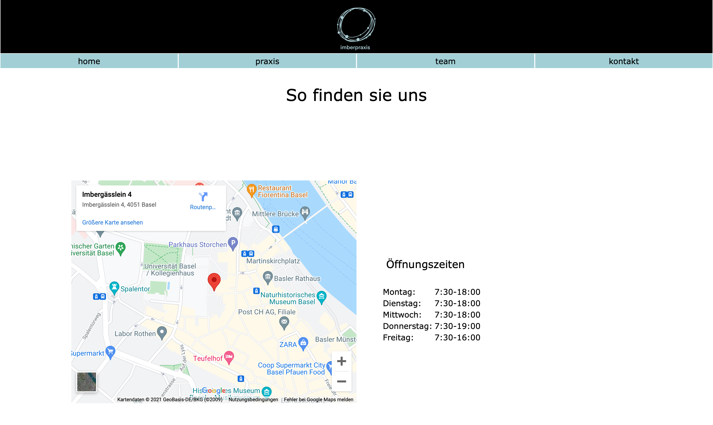


## Zusammenfassung

Zusammenfassung mit Vergleich zwischen Planung und Umsetzung. Was hat geklappt und was nicht? Konnte der Zeitplan eingehalten werden? Konnten die Skizzen umgesetzt werden?

---

Tipps zum README-Markdown:
- Eine Liste kann man einfach so schreiben
- Mit Rechtsklick auf `README.md`, `Open Preview` kann man eine Live-Vorschau des Textes sehen 
- So schreibt man *kursiv*, **fett** und beides ***fettkursiv***
- So kann man ein Bild einfügen: 
- So kann man einen Link einfügen [Linktext](https://google.com)

So kann `einzeiliger Code` eingefügt werden.

So kann mehrzeiliger Code eingefügt werden.
```
.test {
    background-color: blue;
}
```

- Weitere Hilfen gibt es hier: https://guides.github.com/features/mastering-markdown